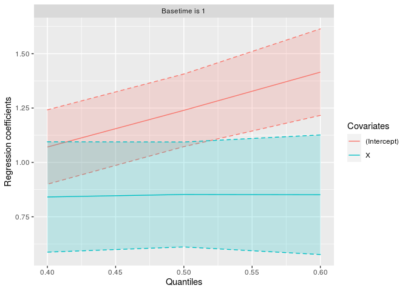

<!-- README.md is generated from README.Rmd. Please edit that file -->

# qris

<!-- badges: start -->
<!-- badges: end -->

The **qris** package implements estimation procedures for a regression
model of the quantiles of residual life, remaining lifetime at a
specific time, subject to right censoring. For estimation of regression
parameters, we consider an induced smoothed method that solves smoothed
weighted estimating equations. We also consider the estimation method
that solves the original non-smooth weighted estimating equations via a
L1 minimization method. To handle data subject to right censoring,
inverse probabilities of censoring are incorporated as weights. For
standard errors estimation, a robust sandwich-type covariance estimator
aided by an efficient resampling method, and a full multiplier bootstrap
approach are considered for the induced smoothed estimator (“smooth”)
and non-smooth estimator (“nonsmooth”), respectively. Furthermore, an
iterative procedure that simultaneously estimates regression parameters
and their standard errors is implemented.

## Installation

You can install the released version of qris from
[GitHub](https://github.com/Kyuhyun07/qris) with:

``` r
> ## install.packages("devtools")
> devtools::install_github("Kyuhyun07/qris")
> library(qris)
```

## Example

There are two examples

``` r
> data.gen <- function(n) {
+     r0 <- .2 * sqrt(log(2))
+     r1 <- .1 * sqrt(log(2))
+     dat <- data.frame(censoring = runif(n, 0, 24.35),
+                       Time0 = sqrt(-log(1 - runif(n))),
+                       X = rbinom(n, 1, .5))
+     dat$Time0 <- ifelse(dat$X > 0, dat$Time0 / r1, dat$Time0 / r0)
+     dat$Time <- pmin(dat$Time0, dat$censoring)
+     dat$status <- 1 * (dat$Time0 < dat$censoring)
+     subset(dat, select = c(Time, status, X))
+ }
> 
> library(survival)
> set.seed(1)
> dat <- data.gen(200)
> fm <- Surv(Time, status) ~ X
> fit1 <- qris(fm, data = dat, t0 = 1, Q = 0.5, ne = 200, "smooth", "pmb", c(1,1))
> fit2 <- qris(fm, data = dat, t0 = 1, Q = 0.5, ne = 200, "nonsmooth", "fmb", "rq")
> fit3 <- qris(fm, data = dat, t0 = 1, Q = 0.5, ne = 200, "iterative", "fmb", "rq",
+                control = qris.control(maxit = 20, tol = 1e-3, trace = TRUE))

 Step: 1
 beta: 1.239291 0.8531057
 se: 0.09210374 0.1227197 

 Step: 2
 beta: 1.239863 0.8527304
 se: 0.07852733 0.1262729 
> 
> summary(fit1)
Call:
qris(formula = fm, data = dat, t0 = 1, Q = 0.5, ne = 200, method = "smooth", 
    se = "pmb", init = c(1, 1))

qris Estimator
            estimate std.Error z.value   p.value    
(Intercept)   1.2395    0.0779  15.922 < 2.2e-16 ***
X             0.8525    0.1220   6.990 < 2.2e-16 ***
---
Signif. codes:  0 '***' 0.001 '**' 0.01 '*' 0.05 '.' 0.1 ' ' 1
> summary(fit2)
Call:
qris(formula = fm, data = dat, t0 = 1, Q = 0.5, ne = 200, method = "nonsmooth", 
    se = "fmb", init = "rq")

qris Estimator
            estimate std.Error z.value   p.value    
(Intercept)   1.2528    0.0992  12.626 < 2.2e-16 ***
X             0.8100    0.1302   6.221 < 2.2e-16 ***
---
Signif. codes:  0 '***' 0.001 '**' 0.01 '*' 0.05 '.' 0.1 ' ' 1
> summary(fit3)
Call:
qris(formula = fm, data = dat, t0 = 1, Q = 0.5, ne = 200, method = "iterative", 
    se = "fmb", init = "rq", control = qris.control(maxit = 20, 
        tol = 0.001, trace = TRUE))

qris Estimator
            estimate std.Error z.value   p.value    
(Intercept)   1.2399    0.0785  15.789 < 2.2e-16 ***
X             0.8527    0.1263   6.753 < 2.2e-16 ***
---
Signif. codes:  0 '***' 0.001 '**' 0.01 '*' 0.05 '.' 0.1 ' ' 1
> 
> coef(fit1)
(Intercept)           X 
  1.2395248   0.8525343 
> summary(fit2)
Call:
qris(formula = fm, data = dat, t0 = 1, Q = 0.5, ne = 200, method = "nonsmooth", 
    se = "fmb", init = "rq")

qris Estimator
            estimate std.Error z.value   p.value    
(Intercept)   1.2528    0.0992  12.626 < 2.2e-16 ***
X             0.8100    0.1302   6.221 < 2.2e-16 ***
---
Signif. codes:  0 '***' 0.001 '**' 0.01 '*' 0.05 '.' 0.1 ' ' 1
> vcov(fit3)
             (Intercept)            X
(Intercept)  0.006166542 -0.006948767
X           -0.006948767  0.015944839
> 
> plot(fit1)
```

<!-- -->

``` r
> ## 2. real data example
> ## Load "retinopathy" data from R survival package
> library(survival)
> ## Real data application
> data(cancer, package = "survival")
> lung2 <- subset(lung, select = c(time, status, age, sex))
> ## tidy up the data
> lung2$status <- lung2$status - 1
> lung2$sex <- lung2$sex - 1
> 
> fm <- Surv(time, status) ~ age + sex
> fit1 <- qris(fm, data = lung2, t0 = 0, Q = 0.5, ne = 200, "iterative", "pmb", "rq")
> fit2 <- qris(fm, data = lung2, t0 = 30, Q = 0.5, ne = 200, "nonsmooth", "fmb", c(1, 0, 1))
> fit3 <- qris(fm, data = lung2, t0 = 100, Q = 0.5, ne = 200,"smooth", "pmb", "rq")
> 
> summary(fit1)
Call:
qris(formula = fm, data = lung2, t0 = 0, Q = 0.5, ne = 200, method = "iterative", 
    se = "pmb", init = "rq")

qris Estimator
            estimate std.Error z.value p.value    
(Intercept)   6.1730    0.6035  10.228  <2e-16 ***
age          -0.0095    0.0091  -1.038  0.2991    
sex           0.4885    0.1646   2.967  0.0030 ** 
---
Signif. codes:  0 '***' 0.001 '**' 0.01 '*' 0.05 '.' 0.1 ' ' 1
> summary(fit2)
Call:
qris(formula = fm, data = lung2, t0 = 30, Q = 0.5, ne = 200, 
    method = "nonsmooth", se = "fmb", init = c(1, 0, 1))

qris Estimator
            estimate std.Error z.value p.value    
(Intercept)   5.6362    0.9262   6.085  <2e-16 ***
age          -0.0015    0.0142  -0.103  0.9183    
sex           0.4489    0.2089   2.148  0.0317 *  
---
Signif. codes:  0 '***' 0.001 '**' 0.01 '*' 0.05 '.' 0.1 ' ' 1
> summary(fit3)
Call:
qris(formula = fm, data = lung2, t0 = 100, Q = 0.5, ne = 200, 
    method = "smooth", se = "pmb", init = "rq")

qris Estimator
            estimate std.Error z.value p.value    
(Intercept)   8.6285    2.3845   3.619  0.0003 ***
age          -0.0601    0.0377  -1.596  0.1104    
sex           1.8121    0.7050   2.570  0.0102 *  
---
Signif. codes:  0 '***' 0.001 '**' 0.01 '*' 0.05 '.' 0.1 ' ' 1
> 
> plot(fit2)
```

<!-- -->

## Reference

Chiou, S., Kang, S., and Yan, J. (2014). Fitting accelerated failure
time model in routine survival analysis with R package aftgee. *Journal
of Statistical Software*, **61**(11): 1–23.

Li, R., Huang, X., & Cortes, J. (2016). Quantile residual life
regression with longitudinal biomarker measurements for dynamic
prediction. *Journal of the Royal Statistical Society*. **Series C**
(Applied Statistics), 755-773.

Jung, S. H., Jeong, J. H., & Bandos, H. (2009). Regression on quantile
residual life. *Biometrics*, **65**(4), 1203-1212.
